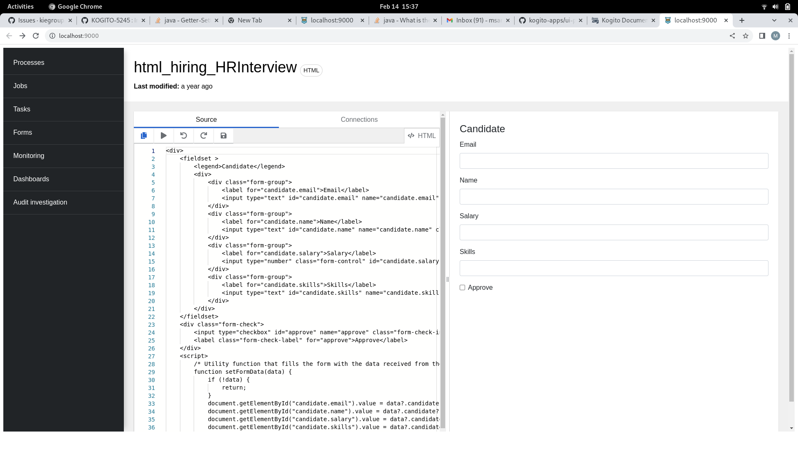
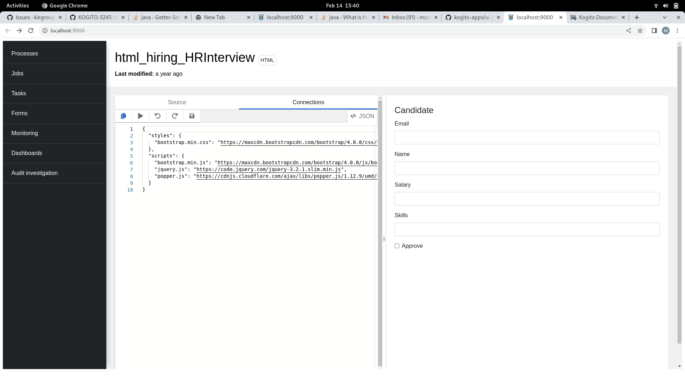

# **Form-details**

When you select a form in the Forms page, you are redirected to the form displayer.The form displayer page consist of _form-details_.

The **form details page contains a code editor,which compiles the source code and displays the results on the right-side panel**.



Initially,the form content and the related configuration are added to the code editor. You can make changes to the code in the editor and click the play icon from the toolbar to execute the code immediately on the browser.

The Source tab loads the source code of the form in HTML or Typescript format based on the selected form.

When the configurations of a form are loaded on the **Connections tab**, _a set of resources including CDN links, URLs pointing to JS or CSS files are added to the form_.



### Install dependencies

To install dependencies you need to have yarn installed globally and run in the terminal:
```
yarn install
```

### Build the project
```
yarn run build:prod
```
Builds the app for production to the dist folder.<br />
It correctly bundles React in production mode and optimizes the build for the best performance.