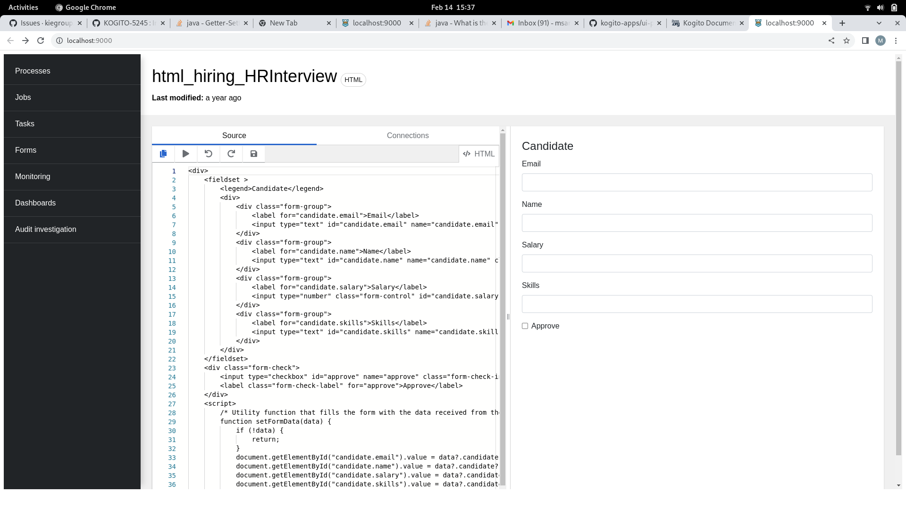

# **Form-displayer**

When you select a form in the Forms page, you are redirected to the _form displayer_ page. 

The form displayer contains a _code editor_, which compiles the **source code and displays the results on the right-side panel**.

  

### Install dependencies

To install dependencies you need to have yarn installed globally and run in the terminal:
```
yarn install
```

### Build the project
```
yarn run build:prod
```
Builds the app for production to the dist folder.<br />
It correctly bundles React in production mode and optimizes the build for the best performance.