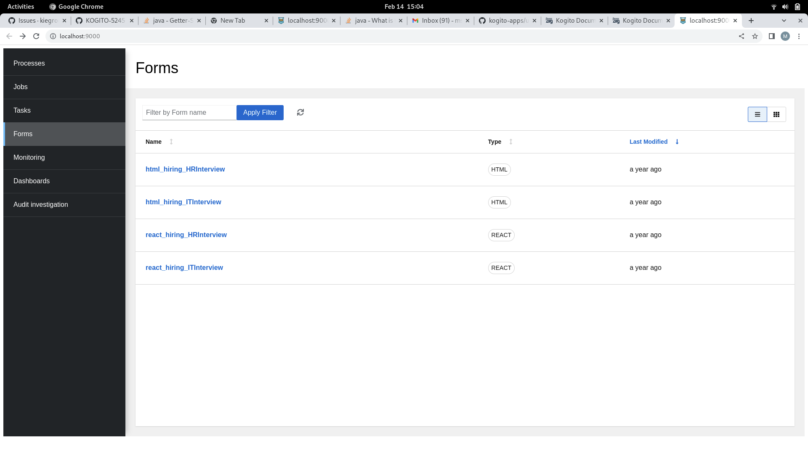

# Kogito-apps Form-list

Kogito Forms-list package consist of some common **Api's** which used across runtime-tools webapp.

These Api's can be used to search the form name ,for applying the filter and to open the perticular forms. 



The Api's used are :

 - getFormFilter()
 - applyFilter()
 - getFormsQuery()
 - openForm()

 ### Install dependencies

To install dependencies you need to have yarn installed globally and run in the terminal:
```
yarn install
```

### Build the project
```
yarn run build:prod
```
Builds the app for production to the dist folder.<br />
It correctly bundles React in production mode and optimizes the build for the best performance.