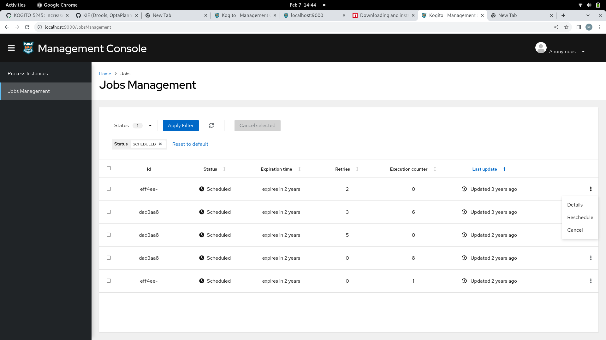
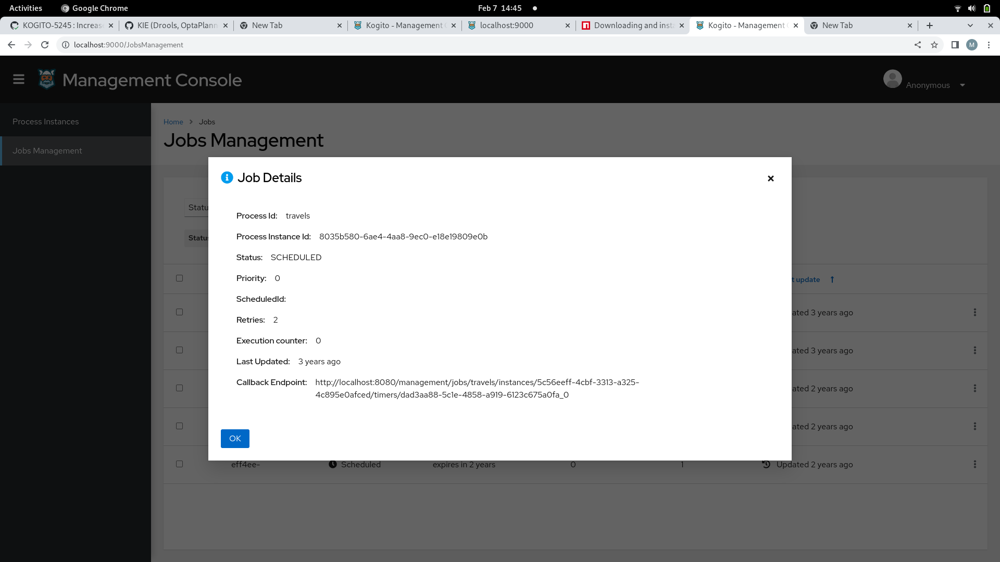

# Kogito management-console-shared

Kogito **management-console-shared** pacakage consist of some common components used in the management-console (in jobs management).<br />

<p align="center">

</p>

<br />
The common components used are:

 * BulkList
 * JobsCancelModal
 * JobsDetailsModal
 * JobsRescheduleModal
 * ProcessInfoModal

 <br />

<p align="center">
  <br />
</p>

<br />

<p align="center">
 
</p>

<br/>

<p align="center">
 
</p>


## Building from source

- Check out the source:
```
git clone git@github.com:kiegroup/kogito-apps.git
```

- Install Node and NPM package manager

See detailed instructions [here](https://docs.npmjs.com/downloading-and-installing-node-js-and-npm) for your OS.

- Install [Yarn](https://classic.yarnpkg.com/)
```bash
cd kogito-apps/ui-packages
npm install -D yarn
```

- Install projects dependencies using Yarn
```bash
cd kogito-apps/ui-packages
yarn install
```

Build with Yarn:
```bash
cd kogito-apps/ui-packages
yarn run init

#prod
yarn run build:prod
```