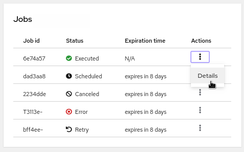
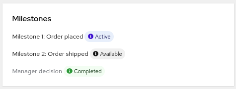

# Kogito Management Console Webapp

The Kogito Management Console is a user interface for viewing the state of all available Kogito services and managing process instances.

Kogito Management Console consists of the following tabs that allow you to interact with your process instances and data:
- [Process Instances](#process-instances)
- [Jobs](#jobs-management)


For more detailed explination about management console go through with the [Kogito Docmentation](https://docs.jboss.org/kogito/release/latest/html_single/#con-management-console_kogito-developing-process-services)


The management-console-webapp includes the following pacakges in it:
- @kogito-apps/components-common
- @kogito-apps/consoles-common
- @kogito-apps/jobs-management
- @kogito-apps/management-console-shared
- @kogito-apps/process-list
- @kogito-apps/process-details

## Tech stack
 
 - React 
 - Typescript
 - Patternfly for CSS

## Prerequisites

 - Java 11+ installed
 - Environment variable JAVA_HOME set accordingly
 - Maven 3.8.1+ installed

## Building from source

- Check out the source:
```
git clone git@github.com:kiegroup/kogito-apps.git
```

- Install Node and NPM package manager

See detailed instructions [here](https://docs.npmjs.com/downloading-and-installing-node-js-and-npm) for your OS.

- Install [Yarn](https://classic.yarnpkg.com/)
```bash
cd kogito-apps/ui-packages
npm install -D yarn
```

- Install projects dependencies using Yarn
```bash
cd kogito-apps/ui-packages
yarn install
```

Build with Yarn:
```bash
cd kogito-apps/ui-packages
yarn run init

#prod
yarn run build:prod
```

## Running the application in dev mode

You can run your application in dev mode that enables live coding using:

```bash
yarn run dev
```

## Working with management-console features

### **Process instances**

The Process Instances tab displays the list of process instances and enables you to add filters to the list.


The process instances page shows the list of process instances available. The list is an expandable list , which shows all the child process instance of the particular process instance when expanded. Each row in the list contains the information about the process instances. The info includes details like name, status, endpoint etc... The list also provides many ways to [filter](#filters) out the process instances and also to perform [process-management](#process-management) operations to the processes. The details of them are mentioned below.

#### Filters


It has two ways of filtering the list:

 * filter by status (a checkbox based filter)
 * search by Business key (a textbox based filter) These two filters can be used in combination to filter the list.


 #### a) Filter by status :

  

 There are five status in total :

   * Active
   * Completed
   * Aborted
   * Suspended
   * Error

Initially the process instance list loads all the active instances available.To search using different filters, click on the dropdown with the **Status** tag and select the necessary status from the dropdown. Click on **Apply filter** to load the new list.Also there is a **chip array** below the filters to show the current filters applied. The filters for status can be removed by either by deselecting the options from the dropdown and clicking on **Apply filter** or by clicking on the **'X'** in the chip.


#### b) Filter by business key :


The business key is a business relevant identifier that might or might not be present in the process instance. The business key, if available would appear as a **blue coloured badge** near the process name in the list. We can enter the business key or parts of business key in the textbox and either click **Apply filter** or press **Enter** key to apply the filter. Similar to the Status filter, the chips with the typed keywords would appear below the textbox. The search for business key works on a OR based condition. Also to remove a filter based on the keyword, click on the **'X'** in the chip to remove and the list will reload to show the applied filter. The search supports Wild cards in its keywords.For example, consider a process having a business key as Tp111. This business key can be searched by entering **T** or **111** or **Tp111**.

### **Bulk Process Actions**

The multi select is used to select multiple process instances while performing bulk [process-management](#process-management) actions.The multi select checkbox by default selects all the parent and child process instances(if loaded). It also has drop-down actions to select none (removes all selections), select only parent process instances, select all the process instances (both parent and child). The multi-select works in correlation with the set of buttons present as a part of the toolbar. The buttons present are - **Abort selected**,**Retry selected** and **Skip selected**. This is a part of the bulk operations performed in the list.


The process instance list allows the user to select multiple process instances and perform bulk process management operations.It consist of Abort selected, Retry selected and Skip selected.The user can select individual process instances by selecting the checkbox present in the list or use the multi select checkbox to select the process instances.

 * Clicking on the Abort selected will open a box to show the instances being aborted and the instances being skipped(An instance which is already in Completed or Aborted cannot be Aborted again, hence the instances are skipped).

 * Clicking on the Retry selected or Skip selected will open a box to show the instances being retriggered or skipped respectively. These actions can be performed on instances which are in Error state only. Other instances(in different states), if selected will appear under the skipped list.

For all the bulk actions, if any of the instance goes throws an error while execution, they appear under the error list of the box.

In addition to these , there is a **reload** button(a sync-icon), to reload the list and a Reset to default button which resets all the filters to its original state(Active status and no business key filter).


### **Process list**


The List shows details of the process instances. Initially it loads only the parent process instances. The following are the details shows in the list :

 * Checkbox
 * Process name
 * State of the process
 * when was the process created
 * when was the process updated
 * a kebab button to provide [process-management](#process-management) functions

The list has a toggle button on the left end, which when toggled would load all the child process instances of that parent process instance. The child process instance also has a similar sturcture as mentioned above.

**Checkbox** - A checkbox to select the process instance to perform [process-management](#process-management) operations.

**Process name** - It shows the process name of the instance along with the business key (as a blue badge) if available. If business key is absent, then it shows the spliced process instance id(spliced to 5 chars). When hovered over the process name ,a tooltip with the full process instance id pops up.

**Status** - The process status along with their corresponding icons is shown. For instances in **Error**, a pop over shows up with the corresponding error message. Also there is a provision to either Skip or Retry the error instance.

**Process Created** - This shows the time elapsed from the process creation.

**Last Updated** - This shows the time elapsed from the last update.

**Kebab button** - The kebab button is enabled or disabled based on the process instance status and the contents of the kebab button varies based on the process-management capability provided to the particular instance. It consists of Abort, Skip and Retry.


### Process management

There are currently three process management capabilities in the process instance list.

 * Abort
 * Skip
 * Retry

 #### **Abort** :

 An instance which is either in Active, Error, Suspended state can be aborted. Clicking on the abort would open up a box displaying the instance which was aborted.

 #### **Skip** :

 A node in _Error_ state can be skipped. Clicking on the skip would open up a box displaying the success or failure status of the skip operation.

#### **Retry** :

A node in _Error_ state can be Retriggered. Clicking on the Retry would open up a box displaying the success or failure status of the Retry operation.

### **Process instance Details**


The process details page consist of the following :

**Heading**

The heading shows the name of the process instance. The heading also shows the business key(if available) as a blue coloured badge. In the absence of business key it shows the process instance id as a concatenated string.

**Process management buttons**

The process management buttons consist of the following

 * _Abort_ - Abort button aborts the process instance. Clicking on abort button results in opening a checkbox to show the process instance which was aborted.

**Details**


 The details consist of the following :

  * Name - shows the name of the travels
  * BusinessKey - shows the business key if available
  * State - shows the current state of the process instance
  * Id - shows the full unique id of the process instance
  * Endpoint - Shows the endpoint of the backend to which the client is connected
  * Start - shows the time elapased from the start of the process
  * End - shows the time elapased from the end of the process(if available)
  * Parent process - shows if the current process instance has a parent process. Allows navigation to the parent process when clicked on. Shows the unique id when hovered over.
  * Sub processes - shows if the current process instance has sub processes.Allows navigation to the respective child process when clicked on. Shows the unique id when hovered over.

**Timeline**


The timeline shows the timeline of all the nodes of a process.It shows the state of the node(Active or Completed or Error), the name of the node(User Icon on the side for user tasks ) and a kebab button. The nodes in error are shown(hovering over the error icon would sho the error message) can be skipped or retriggered by selection the required option from the kebab toggle.

**Process variables**


The process variables shows the domain data in JSON format.

### **Process Diagram**


The process diagram panel contains the BPMN process diagram, which the users you to view the current progress of the process.

### **Jobs Panel**




The Jobs panel shows the list of jobs(timer) and we can execute operations on the jobs using this panel. The available operations are - _View details_, _Reschedule_ and _Cancel_.

### **Node Trigger Panel**


The nodes of a process can be tirggered manually using this panel. It consist of a dropdown, which shows the list of triggerable nodes. Once the required node is selected, click on Trigger button to trigger the node.


### **Milestones Panel**




The milestones panel show the list of milestones present and their current states.


### **Jobs management**


The Jobs Management tab displays the list of existing jobs, which you can filter and perform related management actions such as viewing job details, rescheduling a job, or canceling a job.

You can also cancel the multiple jobs at the same time. To cancel multiple jobs, select the jobs to be canceled and click the **_Cancel Selected_** button.