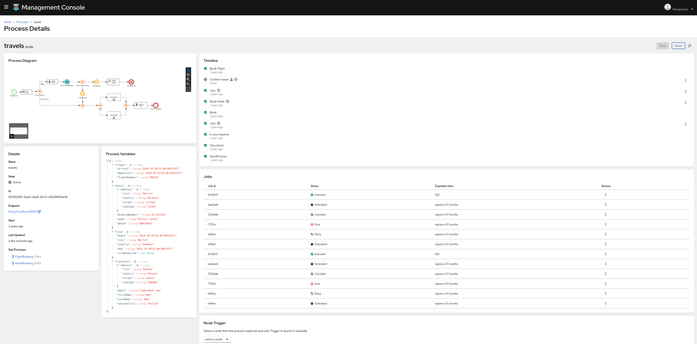

# **Kogito Process-Details**

The process-details package consist of some common components used in Management-console.
<br />

 
The components used are :

 * JobActionKebab
 * JobsPanel
 * ProcessDetails
 * ProcessDetailsErrorModal
 * ProcessDetailsMilestonesPanel
 * ProcessDetailsNodeTrigger
 * ProcessDetailsPanel
 * ProcessDetailsTimelinePanel
 * ProcessDiagram
 * ProcessVariables
 * SwfCombinedEditor

  For the details explination about all these components check management-console-webapp [Readme](../management-console-webapp/README.md)


### Install dependencies

To install dependencies you need to have yarn installed globally and run in the terminal:
```
yarn install
```

### Build the project
```
yarn run build:prod
```
Builds the app for production to the dist folder.<br />
It correctly bundles React in production mode and optimizes the build for the best performance.