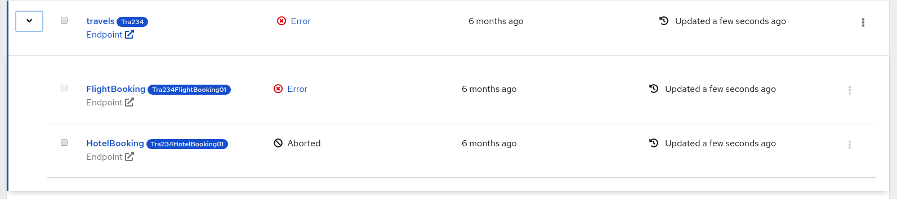

# Kogito Process-List



The Process-List shows details of the process instances. Initially it loads only the parent process instances. The following are the details shows in the list :

 * Checkbox
 * Process name
 * State of the process
 * when was the process created
 * when was the process updated
 * a kebab button to provide process-management functions

The list has a toggle button on the left end, which when toggled would load all the child process instances of that parent process instance. The child process instance also has a similar sturcture as mentioned above.

For detailed Explination about the working of Process-List pacakge, please check the readme file of Management-console-webapp [README](../management-console-webapp/README.md) file.
<br />

### Install dependencies

To install dependencies you need to have yarn installed globally and run in the terminal:
```
yarn install
```

### Build the project
```
yarn run build:prod
```
Builds the app for production to the dist folder.<br />
It correctly bundles React in production mode and optimizes the build for the best performance.