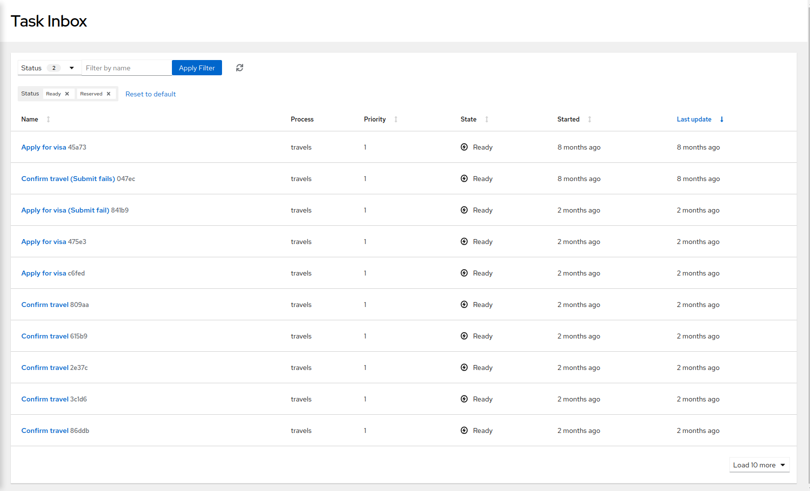
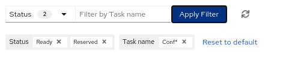
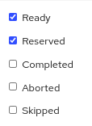
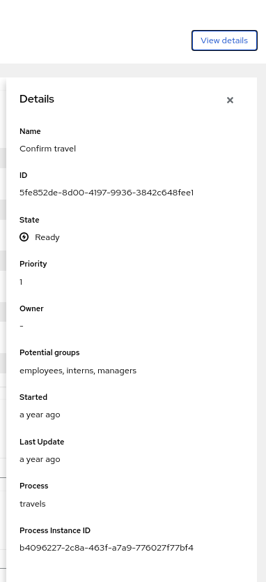

# Task-console-webapp

The Kogito Task Console is a **_user interface for viewing and interacting with user tasks_** in Kogito process services.

The task-console-webapp includes the following pacakges in it:

- @kogito-apps/components-common
- @kogito-apps/consoles-common
- @kogito-apps/patternfly-base
- @kogito-apps/task-details
- @kogito-apps/form-displayer
- @kogito-apps/task-form
- @kogito-apps/task-inbox

For more detailed explination about task-console go through with the [Kogito Docmentation](https://docs.jboss.org/kogito/release/latest/html_single/#con-management-console_kogito-developing-process-services)

## Tech stack
 
 - React 
 - Typescript
 - Patternfly for CSS

## Prerequisites

 - Java 11+ installed
 - Environment variable JAVA_HOME set accordingly
 - Maven 3.8.1+ installed

## Building from source

- Check out the source:
```
git clone git@github.com:kiegroup/kogito-apps.git
```

- Install Node and NPM package manager

See detailed instructions [here](https://docs.npmjs.com/downloading-and-installing-node-js-and-npm) for your OS.

- Install [Yarn](https://classic.yarnpkg.com/)
```bash
cd kogito-apps/ui-packages
npm install -D yarn
```

- Install projects dependencies using Yarn
```bash
cd kogito-apps/ui-packages
yarn install
```

Build with Yarn:
```bash
cd kogito-apps/ui-packages
yarn run init

#prod
yarn run build:prod
```

## Running the application in dev mode

You can run your application in dev mode that enables live coding using:

```bash
 yarn run dev
```
## **Working with Task Console features**

The task console shows a list of user tasks which are available for a process. Each column contains detailed information about the user task which are - _Name_, _Process_, _Priority_, _Status_, _Started_ and _Last update_. The columns are sortable.



The task console consist of filters, which can be used to narrow down the search on a user task. There are two filters available

 - A filter based on the status(dropdown)
 - A filter based on the task name(text search)



The _Status_ filter can be dropped down to view the and select the states available



A _refresh_ button is available to refresh the list of user tasks

A _Reset_ to default button is available to reset the filters to its initial state.

Clicking on the name of the user task will navigate to another screen, which consist of the auto generated forms.

## **Task details**

The task details page consist of an auto generated forms and buttons to perform corresponding action on the user tasks.


Depending on the current phase of the selected task, you can select from the available actions for that task, such as **Abort**, **Release**, **Skip**, or **Complete**, to move the task to the next phase.

The task details page also contains a **_View details_** button, to view more details about the task.

