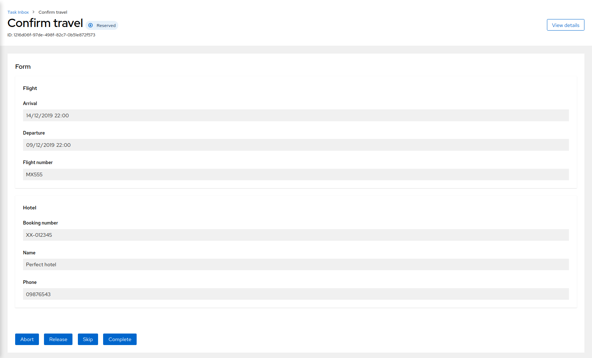
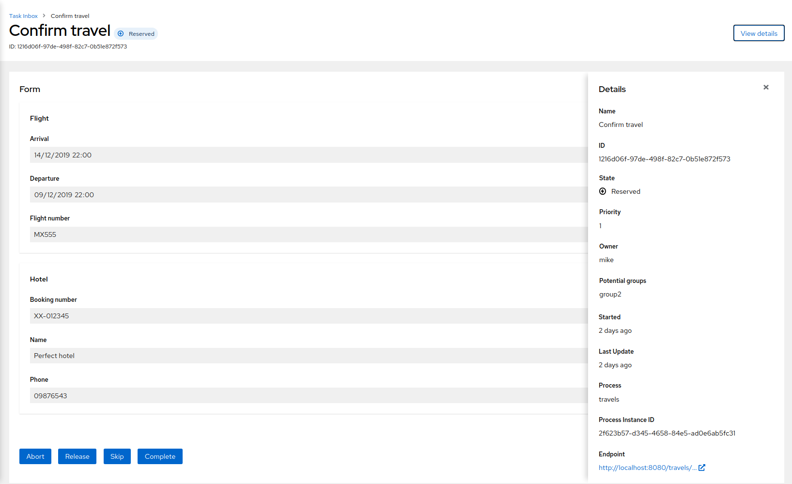

# **Task-details**

Select a task name to view task details and interact with the task.



The task details page consist of all the details related to each task.example for the flight booking we have all the details as _arrival time_, _departure time_ and _flight number_ etc.

Depending on the current phase of the selected task, we can select from the available actions for that task, such as **Abort**, **Release**, **Skip**, or **Complete**, to move the task to the next phase.

For additional task details, you can select **View details**. This panel lists the task ID, state, owner, related process instance ID, and other helpful information about the task.




### Install dependencies

To install dependencies you need to have yarn installed globally and run in the terminal:
```
yarn install
```

### Build the project
```
yarn run build:prod
```
Builds the app for production to the dist folder.<br />
It correctly bundles React in production mode and optimizes the build for the best performance.